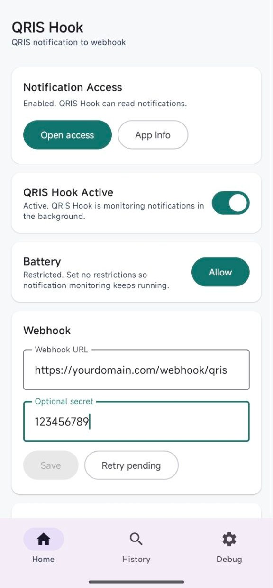
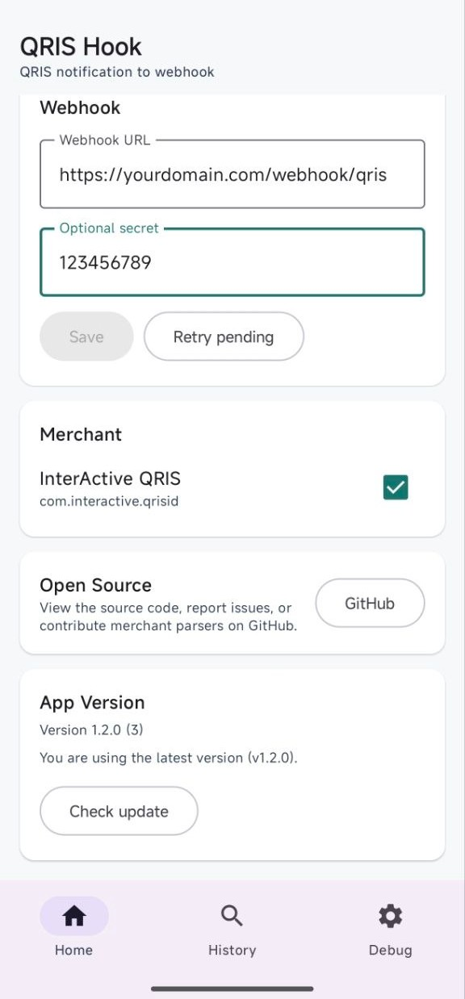
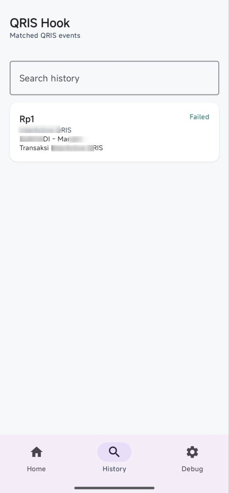
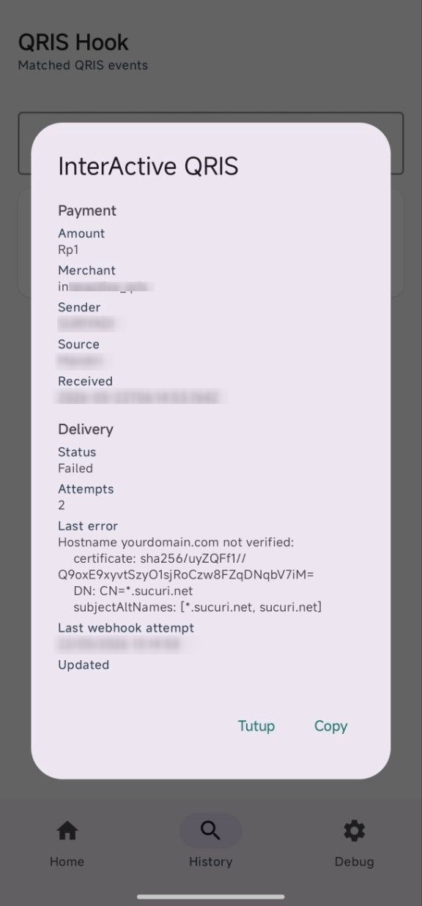
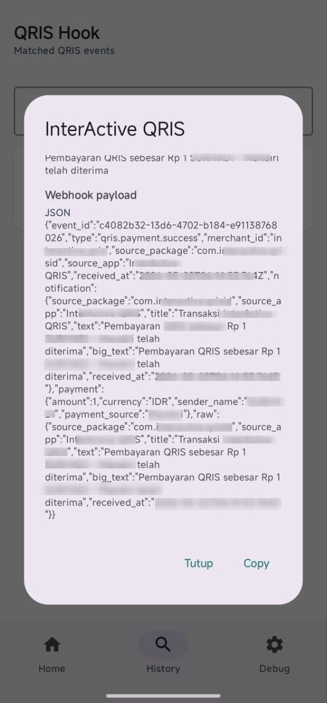
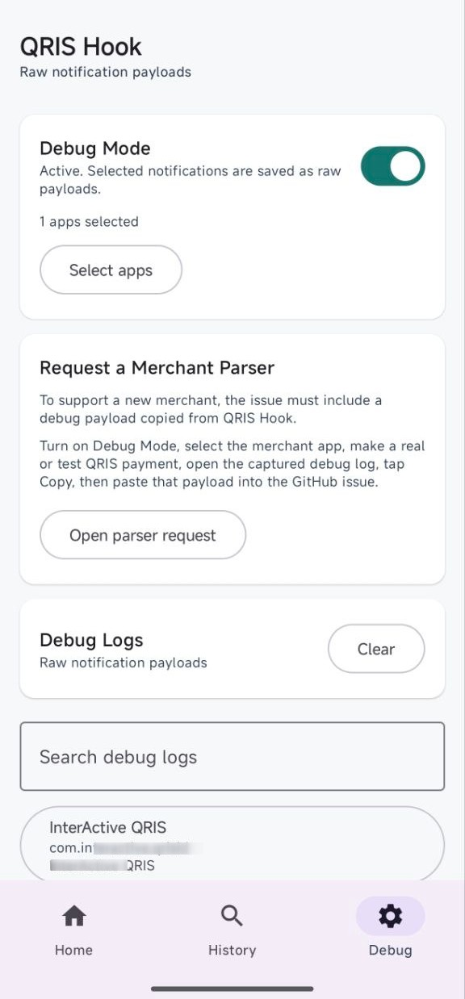
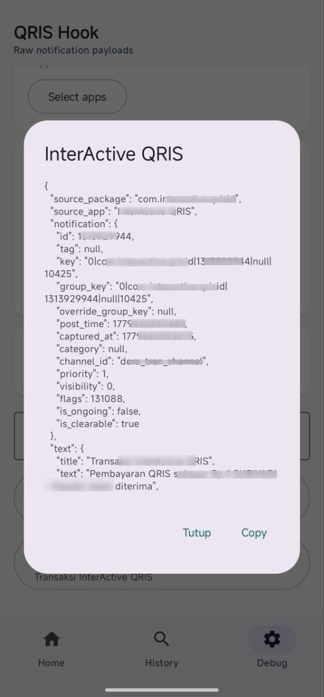

# QRIS Hook

QRIS Hook is a native Android Kotlin app that watches QRIS payment notifications from merchant apps and sends matching payment events to a webhook URL that you control.

[](https://github.com/suriyadi15/qrishook/releases/latest)
[](https://github.com/suriyadi15/qrishook/releases/latest)

## Screenshots

<p>
  
  
  
  
  
  
  
</p>

## Responsible Use and Disclaimer

QRIS Hook is provided for lawful notification monitoring and webhook automation
where the user has the right and permission to access the relevant device,
notifications, merchant account, and webhook endpoint.

You are solely responsible for how you configure, deploy, and use this
application, including compliance with applicable laws, regulations, merchant
terms, privacy obligations, and third-party service policies.

Any misuse of this application, including unauthorized access, privacy
violations, data manipulation, fraudulent activity, or other unlawful use, is
outside the control and responsibility of the author and contributors.

This software is provided "as is", without warranty of any kind. To the maximum
extent permitted by law, the author and contributors are not liable for any
claim, damage, loss, service interruption, data loss, or other liability arising
from the use, misuse, inability to use, or distribution of this software.

## Features

- Notification monitoring with `NotificationListenerService`.
- Backend-agnostic webhook delivery using JSON `POST` requests.
- Optional `X-Webhook-Secret` header.
- Built-in merchant selection through `MerchantRegistry`.
- Merchant-specific parsers for package matching and QRIS payment extraction.
- Webhook payloads with formatted payment data and raw notification fields.
- Local Room queue with background retry using WorkManager.
- Debug mode for capturing raw notification payloads from selected apps.

## How It Works

1. Enable notification access for QRIS Hook in Android settings.
2. Enter your webhook URL and optional secret in the app.
3. Select the merchant apps you want QRIS Hook to monitor.
4. When a matching QRIS payment notification arrives, QRIS Hook parses it into a payment event.
5. The event is queued locally and delivered to your webhook in the background.

When debug mode is enabled, QRIS Hook stores raw notification payloads from selected apps instead of processing them as payment events. This is useful for adding or fixing merchant parsers.

### QRIS Hook Active and Debug Mode

`QRIS Hook Active` is the master switch for QRIS Hook notification handling. When it is turned off, QRIS Hook does not process incoming notifications at all, even if `Debug Mode` is enabled. Existing merchant selections, debug settings, and selected debug packages remain saved, but no payment events or debug payloads are created until QRIS Hook is active again.

When `Debug Mode` is enabled while QRIS Hook is active, debug capture takes priority over normal QRIS processing. Notifications from selected debug packages are saved as raw payloads, and webhook delivery is skipped for those notifications.

| QRIS Hook Active | Debug Mode | Behavior |
| --- | --- | --- |
| Off | Off | Incoming notifications are ignored. |
| Off | On | Incoming notifications are still ignored; no debug logs are captured. |
| On | Off | Matching QRIS notifications are parsed and queued for webhook delivery. |
| On | On | Raw notifications from selected debug packages are saved; webhook delivery is skipped. |

### Webhook Delivery and Retry Logic

QRIS Hook does not send webhook requests directly from Android's notification
listener callback. Matching QRIS notifications are first saved into the local
Room database, then QRIS Hook immediately attempts webhook delivery from the
app's background coroutine. `WebhookDeliveryWorker` is kept as the retry and
fallback path for failed or still-queued events.

Delivery flow:

1. `NotificationProcessor` reads the current settings.
2. If `QRIS Hook Active` is off, the notification is ignored.
3. If `Debug Mode` is on, selected raw notification payloads are saved and webhook delivery is skipped.
4. In normal mode, the notification is matched against the selected merchant parsers.
5. Every matching payment event is inserted into the local queue with status `Pending`.
6. QRIS Hook immediately marks the event as `Sending` and sends it as a JSON `POST` request to the configured webhook URL.
7. A successful 2xx response marks the event as `Sent`.
8. A failed request marks the event as `Failed` and enqueues `WebhookDeliveryWorker` for retry.

`Pending` does not mean the webhook request has already failed. It means the
event has been saved and is waiting to enter delivery. For newly received
notifications this should be brief because QRIS Hook attempts delivery
immediately after inserting the event. When delivery starts, the status is first
changed to `Sending`. If the request succeeds with a 2xx response, the status
becomes `Sent`. If the request fails, the status becomes `Failed` and the event
remains eligible for retry.

If a new event stays at `Pending` for more than a moment, immediate delivery did
not start for that event. Check that notification processing did not fail before
the delivery step and that the app has a saved webhook URL. For older queued
events, use the app's `Retry pending` button to enqueue
`WebhookDeliveryWorker`; the worker requires a connected network and may still be
affected by Android background scheduling.

Delivery status:

| Status | Meaning |
| --- | --- |
| `Pending` | Event has been queued and is waiting to enter delivery. |
| `Sending` | Webhook delivery is currently being attempted. |
| `Sent` | Webhook returned a successful 2xx response. |
| `Failed` | Last delivery attempt failed and the event remains eligible for retry. |

Retry behavior:

- New events are attempted immediately after they are saved.
- The worker processes retry/fallback events with status other than `Sent`, oldest first, in batches of up to 10.
- Successful 2xx responses mark the event as `Sent`.
- Non-2xx HTTP responses, network errors, invalid webhook URL errors, timeout errors, and Android network security errors are recorded as failures.
- Failed attempts update `lastError`, `lastResponseCode`, `lastResponseMessage`, `lastResponseBody`, `lastWebhookAttemptAtMillis`, and increment `attempts`.
- If any event in the batch fails, the worker returns `Result.retry()`.
- WorkManager retries with exponential backoff starting at 30 seconds.
- New retry enqueues replace the existing unique retry work so they are not appended behind an old retry chain.
- QRIS Hook currently has no app-level maximum retry limit; failed events remain in the queue until they are eventually sent or the app data is cleared.

## Webhook Payload

```json
{
  "event_id": "uuid",
  "type": "qris.payment.success",
  "merchant_id": "mandiri_merchant",
  "source_package": "com.example.merchant",
  "source_app": "Mandiri Merchant",
  "received_at": "2026-05-21T12:00:00+07:00",
  "notification": {
    "source_package": "com.example.merchant",
    "source_app": "Mandiri Merchant",
    "title": "string",
    "text": "string",
    "big_text": "string",
    "received_at": "2026-05-21T12:00:00Z"
  },
  "payment": {
    "amount": 10000,
    "currency": "IDR",
    "sender_name": "John Doe",
    "payment_source": "Mandiri"
  },
  "raw": {
    "source_package": "com.example.merchant",
    "source_app": "Mandiri Merchant",
    "title": "string",
    "text": "string",
    "big_text": "string",
    "received_at": "2026-05-21T12:00:00Z"
  }
}
```

If a secret is configured, the webhook request includes:

```http
X-Webhook-Secret: your-secret
```

## Build

Requirements:

- Android Studio or a configured Android SDK.
- JDK 17 or newer.

Build the debug APK:

```bash
./gradlew assembleDebug
```

Run unit tests:

```bash
./gradlew testDebugUnitTest
```

The debug APK is generated at:

```text
app/build/outputs/apk/debug/app-debug.apk
```

## Automated Releases

Pushes to `main` run the GitHub Actions release workflow. The workflow uses
Conventional Commits through `semantic-release` to choose the next version,
builds a signed release APK, creates a GitHub Release, and uploads the APK as a
release asset.

Commit types that create releases:

- `fix: ...` creates a patch release, for example `0.1.0` to `0.1.1`.
- `feat: ...` creates a minor release, for example `0.1.0` to `0.2.0`.
- `feat!: ...` or a commit body with `BREAKING CHANGE:` creates a major release.

Required GitHub repository secrets:

- `ANDROID_KEYSTORE_BASE64`
- `ANDROID_KEYSTORE_PASSWORD`
- `ANDROID_KEY_ALIAS`
- `ANDROID_KEY_PASSWORD`

Create `ANDROID_KEYSTORE_BASE64` from the release keystore:

```bash
base64 -w 0 release-keystore.jks
```

The current local fallback version is `0.1.0`. To make `semantic-release` start
from that version, create and push the initial tag before the first automated
release:

```bash
git tag v0.1.0
git push origin v0.1.0
```

## Adding a Merchant Parser

Add a new parser that extends `MerchantParser`, then register it in `MerchantRegistry.builtInParsers`:

```kotlin
object ExampleMerchantParser : MerchantParser() {
    override val merchantId = "merchant_id"
    override val displayName = "Merchant Name"
    override val merchantPackages = listOf("package.name.merchant")

    private val successKeywords = listOf("qris", "success", "paid")
    private val ignoreKeywords = listOf("failed", "refund", "promo")

    override fun parse(notification: ObservedNotification): QrisPaymentEvent? {
        // Implement merchant-specific parsing here.
        return null
    }
}
```

If multiple selected parsers can handle the same notification, every valid event is added to the webhook queue.

## Contributing Notification Payloads

Notification formats vary between merchant apps and app versions. If QRIS Hook does not recognize a merchant notification, you can help by sharing a debug payload.

1. Enable notification access for QRIS Hook in Android settings.
2. Open QRIS Hook and enable `Debug Mode`.
3. Select the merchant app you want to capture.
4. Trigger a real or test QRIS notification from that merchant app.
5. Open `Debug Logs` in QRIS Hook.
6. Open the captured log and tap `Copy`.
7. Create a `Merchant parser request` GitHub issue with:
   - merchant app name
   - package name
   - expected payment details
   - copied debug payload from QRIS Hook `Debug Mode`

The copied debug payload is required. Parser requests without a debug payload cannot be implemented reliably.

Before posting the issue, redact sensitive data such as customer names, phone numbers, account identifiers, transaction IDs, or any other private information.

## License

QRIS Hook is released under the [MIT License](LICENSE).
